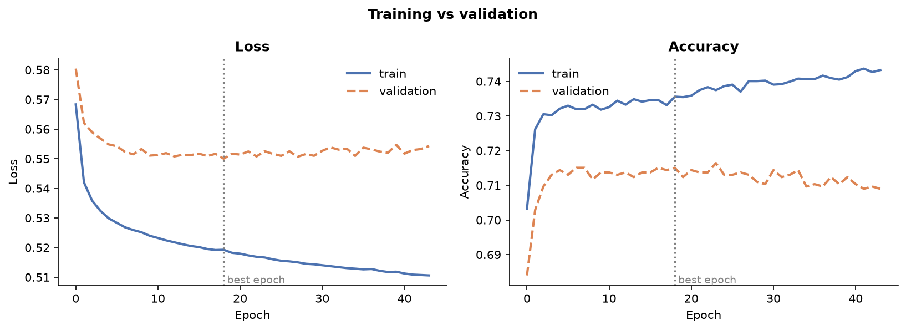
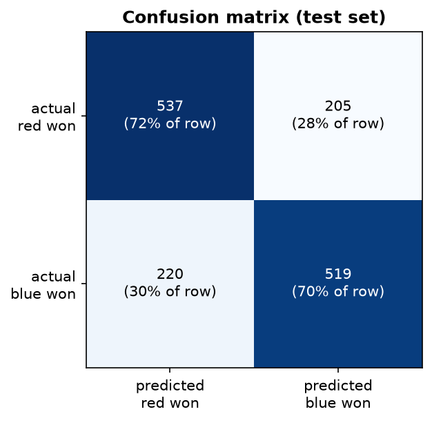
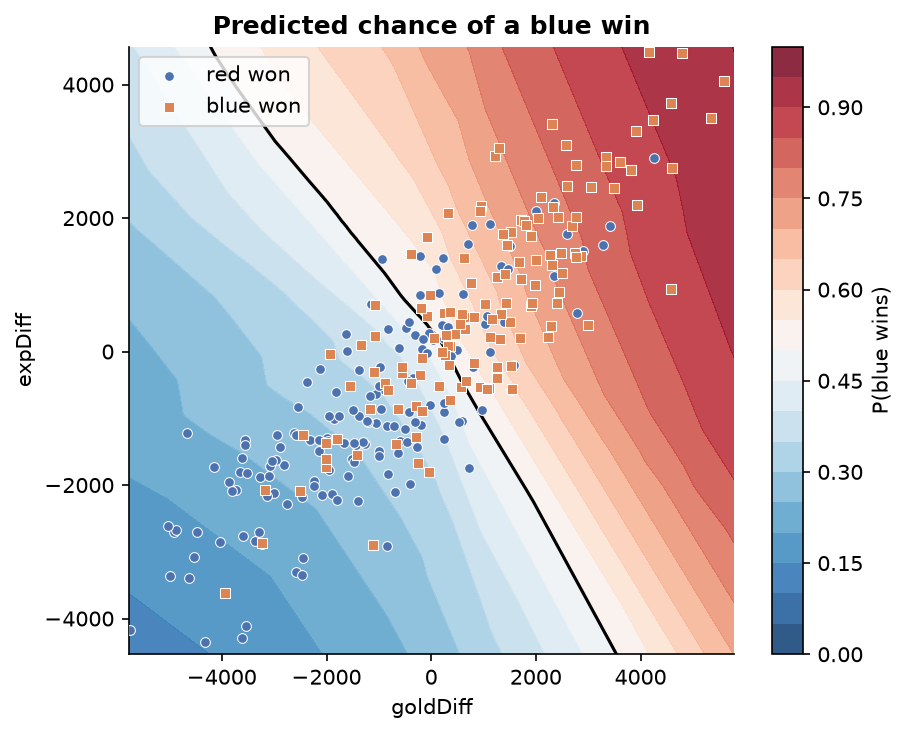
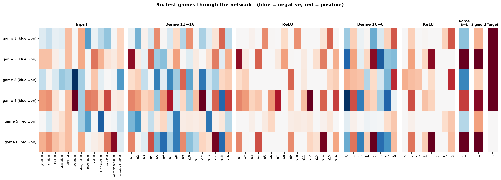

# test_neural_network
A small, modular feed-forward neural network written from scratch with only NumPy, then
used to predict the winner of **League of Legends** games from their first 10 minutes.
No TensorFlow, no PyTorch: forward pass, backpropagation, losses, optimizers, and the
training loop are all implemented in this repository.

It was built to answer two questions: *can I implement backpropagation correctly and
cleanly?* (verified with numerical gradient checks) and *what can a small network learn
from real data?* (about 71% accuracy at predicting the winner, against 50% for guessing).

| Part | Files |
|---|---|
| Layers: base `Layer`, `Dense`, activations (`Tanh`, `Sigmoid`, `ReLU`) | `nn/layer.py`, `nn/dense.py`, `nn/activations.py` |
| Losses: MSE, binary cross-entropy | `nn/losses.py` |
| Optimizers: SGD, SGD with momentum, Adam | `nn/optimizers.py` |
| Training loop: mini-batches, validation, early stopping with best-weights restore | `nn/network.py` |
| Data pipeline: CSV loader, train/val/test split, standardization | `nn/data.py` |
| Metrics and diagnostics: accuracy, confusion matrix, majority baseline, overfitting report | `nn/metrics.py`, `nn/diagnostics.py` |
| Save / load a trained model (weights + scaler) | `nn/persistence.py` |
| Visualizations | `nn/visualize.py` |
| Examples | `examples/xor.py`, `examples/lol_winner.py`, `examples/predict_game.py`, `examples/compare_models.py` |
| Tests (24) | `tests/` |

Features: L2 regularization, He / Xavier initialization, overflow-safe sigmoid.


## Design

A network is a plain Python list of layers:

```python
network = [Dense(13, 16, init="he"), ReLU(), Dense(16, 8, init="he"), ReLU(), Dense(8, 1), Sigmoid()]
```

Every layer follows one contract:

- `forward(X)` returns `Y` and remembers whatever it needs for the backward pass.
- `backward(dE/dY)` returns `dE/dX` (the gradient for the previous layer) and stores the gradients
  of its own parameters. **It never changes its own weights.**
- `params()` / `grads()` expose the trainable arrays and their gradients.

Updating weights is the optimizer's job (`optimizer.step(params, grads)`). Keeping the two
apart means any layer works with any optimizer, and gradients can be checked numerically
without the weights shifting underneath the check.

One training step:

1. **Forward:** feed a batch through every layer.
2. **Error:** compare the output with the target using the loss function.
3. **Backward:** pass `dE/dY` back through the layers in reverse order (chain rule).
4. **Update:** the optimizer adjusts the parameters using the stored gradients. Repeat.

### The math implemented

**Dense layer**, with batch input `X` of shape `(batch, n_in)`:

```
forward:   Y = X W + b
backward:  dE/dW = Xᵀ · dE/dY  (+ λW with L2 regularization)
           dE/db = sum of dE/dY over the batch
           dE/dX = dE/dY · Wᵀ
```

**Activation layer** (elementwise): `dE/dX = dE/dY ⊙ f'(X)`, with
`tanh' = 1 − tanh²`, `sigmoid' = σ(1 − σ)`, and `relu' = 1 if x > 0 else 0`.

**Losses** (averaged over all elements of the batch, so the learning rate does not depend on batch size):

```
MSE:  E = mean((y − p)²)                           dE/dp = 2 (p − y) / N
BCE:  E = −mean(y log p + (1 − y) log(1 − p))      dE/dp = ((1 − y)/(1 − p) − y/p) / N
```

**Optimizers**:

```
SGD:        p ← p − lr · g
Momentum:   v ← μ v − lr · g ;  p ← p + v
Adam:       m ← β1 m + (1 − β1) g ;  v ← β2 v + (1 − β2) g²
            p ← p − lr · m̂ / (√v̂ + ε)      (m̂, v̂ are bias-corrected)
```

### Correctness

`tests/test_gradients.py` compares every layer's analytic gradient, and the gradient of the
full network's loss, against a numerical finite-difference estimate. The check was confirmed
to catch a deliberately planted bug (a gradient 10% too large). The other tests cover the
optimizers, overflow safety, XOR convergence, early stopping, and save/load round-trips.

## Setup

```
python -m venv .venv
.venv\Scripts\Activate.ps1          # Windows PowerShell  (Mac/Linux: source .venv/bin/activate)
pip install -r requirements.txt
```

## Run it

Always run from the project root.

```
python -m examples.xor                  # classic sanity check: learn XOR, with visualizations
python -m tests.test_gradients          # also: tests.test_training, tests.test_persistence
python -m examples.lol_winner           # train on the real data, evaluate, save the model
python -m examples.predict_game goldDiff=2000 expDiff=1000 killDiff=3
python -m examples.compare_models       # logistic regression vs the network, over 5 splits
```

With pytest installed, `python -m pytest` runs all the tests at once.

**Data:** download `high_diamond_ranked_10min.csv` from Kaggle
(*League of Legends Diamond Ranked Games (10 min)*, about 9,900 high-rank solo queue games)
and place it at `data/high_diamond_ranked_10min.csv`.

### The League of Legends task

Each game is described by 13 numbers from its first 10 minutes, mostly **blue minus red**
differences (gold, XP, kills, assists, towers, dragons, heralds, CS, jungle CS, level, wards, plus
who got first blood). The target is whether blue won. Data is split 70% train / 15% validation /
15% test; features are standardized with **training-set statistics only**; the test set is used
exactly once, at the end.

## Results

Run on the real dataset (9,879 games: 6,917 train / 1,481 validation / 1,481 test):

| | |
|---|---|
| **Test accuracy** | **71.3%** (95% margin of error about ±2.3 points) |
| Always-guess-majority baseline | 50.1% |
| Early stopping | best epoch 19 (validation loss 0.550), stopped at epoch 44 |

Confusion matrix on the test set (rows = actual, columns = predicted):

| | predicted red won | predicted blue won |
|---|---|---|
| **actual red won** | 537 (72%) | 205 (28%) |
| **actual blue won** | 220 (30%) | 519 (70%) |

`lol_winner` finishes with an overfitting report (train vs validation gap at the best epoch, and what
happened to both losses afterwards). `nn/diagnostics.py` holds it.

The errors are balanced between the two sides. Validation loss flattens after roughly 10 epochs
while training loss keeps falling, which is mild overfitting (about 74% training accuracy vs
about 71% validation), and the reason early stopping restores the epoch-19 weights.



| Confusion matrix | Win probability by gold and XP lead |
|---|---|
|  |  |

The map above varies two features and holds the others at their averages, so it is an
illustration rather than a full picture. The layer-by-layer view of six test games:



## Limitations

- **Only a 10-minute snapshot.** The model sees no champions, player skill, items, or anything after
  minute 10, and many games are still undecided then. This caps the accuracy any model can reach on
  this data. Using stats from a later point in a game gives wrong answers, since the model has no
  notion of time.
- **Narrow population.** The games are from high-rank solo queue.
  It may not transfer to other ranks, pro play, or other game patches.
- **Sampling noise.** With about 1,500 test games, a single accuracy figure has a standard error of
  about 1.2 points (a 95% margin of roughly ±2.3), so small differences between configurations are
  not meaningful.
- **Calibration is unchecked.** A predicted 74% has not been verified to correspond to winning
  about 74% of the time.
- **Hyperparameters** (layer sizes, learning rate, `l2`) were set by hand, not searched.

## Ideas for next steps

Cross-validation and calibration plots; a hyperparameter sweep; timeline features (win probability
at minutes 5, 10, 15, 20); champion embeddings for draft information; dropout; softmax output with
MNIST as a second task.
